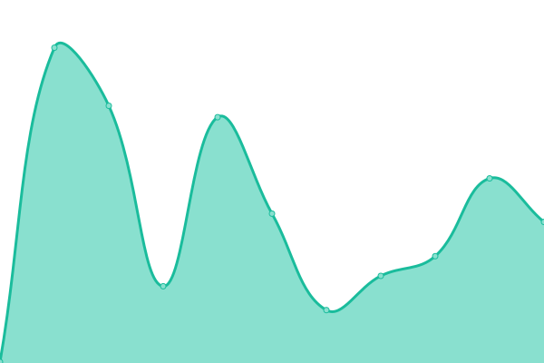
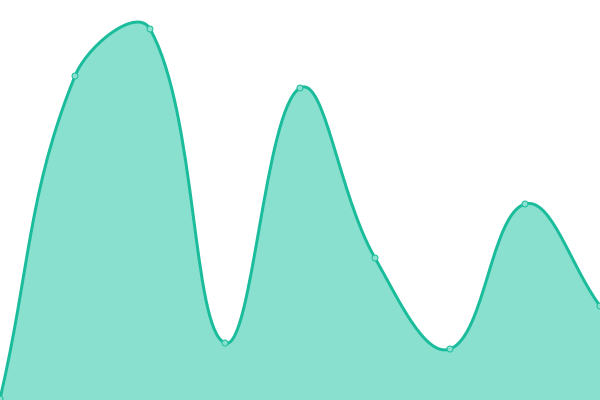
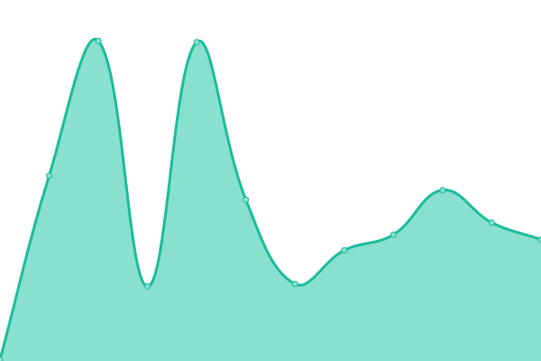
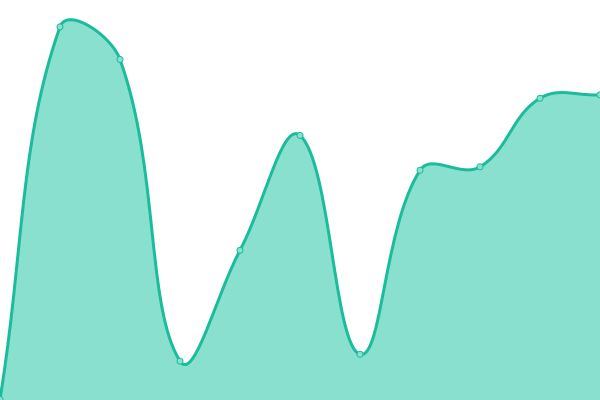
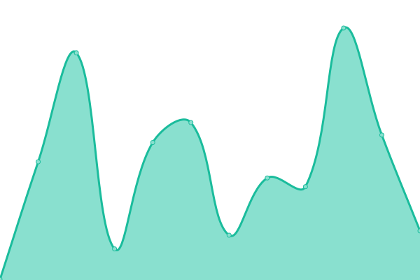

# [📈 Live Status](https://status.snappypreview.com): <!--live status--> **All systems are operational**

This repository contains the open-source uptime monitor and status page for [Maximiliano Robledo](https://status.snappypreview.com), powered by [Upptime](https://github.com/upptime/upptime).

With [Upptime](https://upptime.js.org), you can get your own unlimited and free uptime monitor and status page, powered entirely by a GitHub repository. We use [Issues](https://github.com/maxirobledo/upptime/issues) as incident reports, [Actions](https://github.com/maxirobledo/upptime/actions) as uptime monitors, and [Pages](https://status.snappypreview.com) for the status page.

<!--start: status pages-->
<!-- This summary is generated by Upptime (https://github.com/upptime/upptime) -->
<!-- Do not edit this manually, your changes will be overwritten -->
<!-- prettier-ignore -->
| URL | Status | History | Response Time | Uptime |
| --- | ------ | ------- | ------------- | ------ |
|  [Snappy Chat](https://chat.snappylabs.io/) | 🟩 Up | [snappy-chat.yml](https://github.com/maxirobledo/upptime/commits/HEAD/history/snappy-chat.yml) | 

 216ms
     
 | 

<a href="https://status.snappypreview.com/history/snappy-chat">96.90%</a>
    

|  [Snappy LAPI](https://api.snappylabs.io/) | 🟩 Up | [snappy-lapi.yml](https://github.com/maxirobledo/upptime/commits/HEAD/history/snappy-lapi.yml) | 

 266ms
     
 | 

<a href="https://status.snappypreview.com/history/snappy-lapi">96.91%</a>
    

|  [Snappy Payments](https://pp.snappylabs.io/) | 🟩 Up | [snappy-payments.yml](https://github.com/maxirobledo/upptime/commits/HEAD/history/snappy-payments.yml) | 

 187ms
     
 | 

<a href="https://status.snappypreview.com/history/snappy-payments">96.92%</a>
    

|  [Snappy app](https://app.snappycommerce.io/) | 🟩 Up | [snappy-app.yml](https://github.com/maxirobledo/upptime/commits/HEAD/history/snappy-app.yml) | 

 395ms
     
 | 

<a href="https://status.snappypreview.com/history/snappy-app">96.93%</a>
    

|  [Snappy commerce](https://snappycommerce.io/) | 🟩 Up | [snappy-commerce.yml](https://github.com/maxirobledo/upptime/commits/HEAD/history/snappy-commerce.yml) | 

 207ms
     
 | 

<a href="https://status.snappypreview.com/history/snappy-commerce">96.95%</a>
    

|  [Hello world](https://example.snappypreview.com/) | 🟩 Up | [hello-world.yml](https://github.com/maxirobledo/upptime/commits/HEAD/history/hello-world.yml) | 

 176ms
     
 | 

<a href="https://status.snappypreview.com/history/hello-world">100.00%</a>
    

<!--end: status pages-->

[**Visit our status website →**](https://status.snappypreview.com)

## 📄 License

- Powered by: [Upptime](https://github.com/upptime/upptime)
- Code: [MIT](./LICENSE) © [Maximiliano Robledo](https://status.snappypreview.com)
- Data in the `./history` directory: [Open Database License](https://opendatacommons.org/licenses/odbl/1-0/)
